# IFN-Transport

IFN-Transport is an extension and an application of [Ideal Flow Network (IFN)](https://github.com/teknomo/IdealFlowNetwork) for transportation networks synthesis and analysis written in Python. The online version of IFN-Transport is also available in [Revoledu](https://people.revoledu.com/kardi/tutorial/IFN/IFN-transport.html). Check this [video on YouTube](https://www.youtube.com/watch?v=kEr_IbcEbKw) on how the IFN-Transport works.

## Overview of IFN-Transport Idea
Here's the underlying concept:

1. **Supply's Role in Demand:** The structure of a network, which we refer to as the supply side, greatly influences its utilization or demand side. This implies that by understanding the network's design, such as road width or the number of lanes, combined with its connectivity (data which can be sourced from platforms like Google Map or Open Street Map), we can predict traffic volume and congestion on individual links. This invaluable information can further be utilized to estimate factors like speed, travel time, delays, environmental impacts, energy consumption, and the economic implications of proposed projects. Such insights are crucial for effective planning, design, evaluation, and management of traffic flow throughout the network.

2. **Estimation through MEP:** The Maximum Entropy Principle (MEP, as articulated by Jaynes in 1956), provides a robust framework for making predictions, even when confronted with significant missing data. This principle, an extension of the "principle of indifference" or the "principle of insufficient reason" as discussed by giants like Keynes, Leibnitz, Laplace, Bernoulli, and Poincare, states that in the absence of definitive data, assuming a uniform probability distribution is the most rational approach. As more data becomes available, our predictions naturally refine and become more accurate.

3. **IFN's Comprehensive Approach:** IFN operates on a principle of "global scaling" applied across the entire network. By understanding certain variables, such as the scaling factor 'kappa' and the network's stochastic probabilities, we can predict traffic flow on individual links. This prediction aligns with the notion that the total traffic flow in the network is commensurate with 'kappa'. These calculations are rooted in the steady states of the Markov Chain model.

4. **Impact of Road Attributes on Traffic Flow:** Features like the road width and number of lanes directly influence road capacity, referred to as "link capacity." By evaluating this capacity, we can deduce the network's stochastic probability. Essentially, the network structure (supply) gives insights into predicting vehicular flow (demand). Using IFN in this manner ensures a balanced distribution of traffic, optimizing the entire network's capacity utilization.

One appealing reason why transportation engineers should use IFN Transport is because the existing transportation models only encourage widening the road in order to solve traffic congestion. IFN provides an alternative model that enable the engineers to justify the reduction of road width in order to reduce traffic congestion. 

Imagine sharing the road width equally for vehicles and pedestrians. How are we going to justify the important of walkway? It is actually cheaper because all the utility lines (water, internet, sewerage, electricity) can be put under the walkway and it is cheaper to open the tiles of the walkway than to destroy the asphalt or concrete road. If the government will think of long-term solution, they should create the same amount of walkway width and vehicle road width. It would also make the city very beautiful. City who honor pedestrian would eventually honor themselves. This is where the IFN kicked in. Using IFN, we think in term of overall network balance solutions and therefore we can actually reduce the road width for vehicular traffic (and provide wider width for walkway) in order to reduce traffic congestion. Check this [video on YouTube](https://youtube.com/watch?v=h2YN3QYdZqk&feature=share) about the concept of Rebalancing Congestion. Note that we should use maximum congestion instead of averaging the performance.

## What is Traffic Assignment?
Almost everyone hates traffic congestion. What can we do about it? Almost everybody has some kind of ideas to solve the traffic congestion that we face every day. The problem is how to quantify our ideas such that we can evaluate which among our ideas would really work. This is where you need the tool, called traffic assignment software, to help you in modeling the road network, get the current network performance, and then create scenarios to alter the current road network on computer based on your ideas. Comparing the network performance of these scenarios would help you understand which ideas would work and which ideas would not work and which best ideas should be implemented.

Implementing your ideas directly in the actual road construction would cost a lot of time and money and the public would suffer in your experiment. Instead, you should try first all the possible ideas on computer and then you can propose to your government on your ideas. Knowing the exact amount of saving based on the propose scenario would also help you in quantifying the justification of the actual construction.

Given a road network, we would like to know what would be the flow and congestion level and network performances. Traffic assignment is a model to help us in assigning the flow and determine the congestion level on each link. Knowing the congestion level on each link, the program would also help us in finding the other link characteristics such as speed, travel time, delay and other network performances. Our goal in creating this program is to equip you with the best tools to test your creativity such that it can democratize the task to solve the traffic congestion in your own city. We are hoping that anyone (not necessarily as transportation engineer or transportation expert), equipped with these tools, can help in solving the traffic congestion quantitatively through science rather than merely based on opinions.

Many existing traffic assignment models exist but in general, most of them suffer several problems:

1. The traffic assignment software are very expensive (about $10,000 per license and you need to pay maintenance fee per year).
2. Many traffic assignment software are very complicated. The commercial demos are very nice with very lucrative animation but when it comes to solve the real world problem, you start to get a lot of doubt. You need to be a transport expert to input the data and to run the program.
3. Many traffic assignment software requires extensive data, especially Origin-Destination (OD) demand data. The data input are tremendously very expensive to gather and without those data, you are not able to model properly. If you input with any data, then garbage in garbage out.
4. The algorithm inside these commercial software are often heuristics and you treat them as black box without knowing how does it work and what are the assumptions behind the black box. 
5. They encourage road widening as the solution of traffic congestion. IFN-Transport is probably the only tool that provide the alternative way to justify road narrowing in order to balance the traffic congestion.

In contrast, IFN is open source, free to use and free to modify and free to distribute. The usage is relatively very simple, which will be explained in this user guide and it does not requires extensive data. The ideal flow network itself has strong mathematical background, based on Markov Chain and Maximum Entropy maximization whose assumptions are clearly stated. The IFN model is based on mathematical theory and not based on heuristic approach. The more data you have, it would be more accurate but at the most parsimony level, the model can be run without any data aside from the network itself. Based on the maximum entropy principle, we assume the maximum doubt when you have no data.

# References
If you would like to know more about the scientific basis of this work. The following publications are the foundations of Ideal Flow analysis.  Kindly read and cite any of the following papers in your references if you use this software.

* Teknomo, K.(2019), Ideal Flow Network in Society 5.0 in Mahdi et al, Optimization in Large Scale Problems - Industry 4.0 and Society 5.0 Applications, Springer, p. 67-69
* Teknomo, K. and Gardon, R.W. (2019) Traffic Assignment Based on Parsimonious Data: The Ideal Flow Network, 2019 IEEE Intelligent Transportation Systems Conference (ITSC), 1393-1398.
* Teknomo, K., Gardon, R. and Saloma, C. (2019), Ideal Flow Traffic Analysis: A Case Study on a Campus Road Network, Philippine Journal of Science 148 (1): 5162.
* Teknomo, K. (2018) Ideal Flow of Markov Chain, Discrete Mathematics, Algorithms and Applications, doi: 10.1142/S1793830918500738
* Teknomo, K. and Gardon, R.W. (2017) Intersection Analysis Using the Ideal Flow Model, Proceeding of the IEEE 20th International Conference on Intelligent Transportation Systems, Oct 16-19, 2017, Yokohama, Japan
* Teknomo, K. (2017) Ideal Relative Flow Distribution on Directed Network, Proceeding of the 12th Eastern Asia Society for Transportation Studies (EASTS), Ho Chi Minh, Vietnam Sept 18-21, 2017.
* Teknomo, K. (2017) Premagic and Ideal Flow Matrices. https://arxiv.org/abs/1706.08856
* Gardon, R.W. and Teknomo, K. (2017) Analysis of the Distribution of Traffic Density Using the Ideal Flow Method and the Principle of Maximum Entropy, Proceedings of the 17th Philippine Computing Science Congress, Cebu City, March 2017
* Teknomo, K. (2015) Ideal Flow Based on Random Walk on Directed Graph, The 9th International collaboration Symposium on Information, Production and Systems (ISIPS 2015) 16-18 Nov 2015, Waseda University, KitaKyushu, Japan.

# Installation
There is no need for installation on the IFN-Transport itself. Simply [download the zip file](https://github.com/teknomo/ifn-transport/archive/refs/heads/main.zip) and unzip the whole code into a local folder. You need to install [Python 3.10](https://www.python.org/downloads/) in order to run this software.

Then in command prompt, cd to the code folder and install the requirements:
> pip install -r requirements.txt

# Run the IFN-Transport
Run **main.py** in any Python IDE.

Alternatively, go into the folder where you unzip the code of IFN Transport and change directory into that folder in Command Line and type:
> python main.py

# IFN-Transport Tutorial
The graphical user interface of the main program 
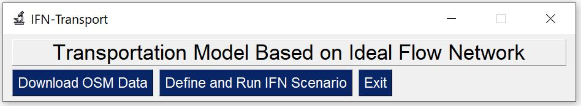

### Download OSM Data
Select the "Download OSM Data" button from the main.py to get the OSM2IFN.py windows, which graphical user interface is as follow.

If you type the city name and press "Get Boundary" button, it might help you to fill the coordinate boundary.
Alternatively, you can "Go to OSM" web page to set the coordinate boundary
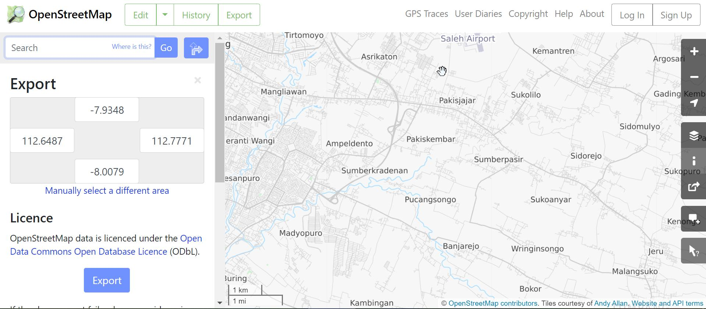

Once the Top, Left, Right and Bottom coordinates are set, select the road type that you want to download, specify the file names of node and link if necessary. Them click "Download Map" button to download the map.

The original file from OSM is in XML format.
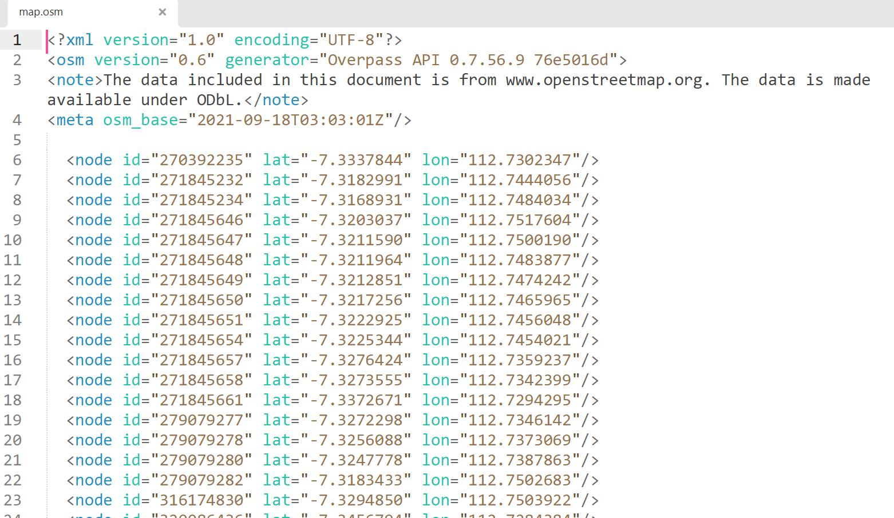

The IFN-Transport would convert it into CSV format that you can open in Excel.
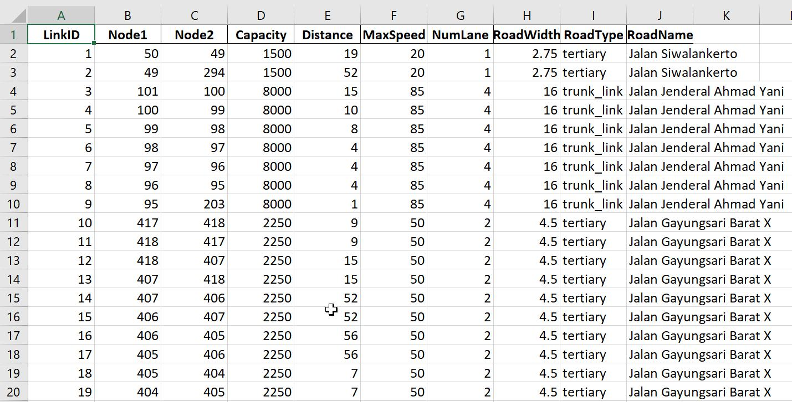

The field of capacity, distance, max speed, number of lanes, road width would be approximated if not exist in OSM. Here are the fields of the converted OSM data.

> LinkID,Node1,Node2,Capacity,Distance,MaxSpeed,NumLane,RoadWidth,RoadType,RoadName

The field of the node file from OSM data would be as follow.
> NodeID,X,Y,osmID

The data would also be cleaned automatically to get the largest strongly connected network when you check the data cleaning scheme.

Once you have downloaded the map data, click "Display Network"
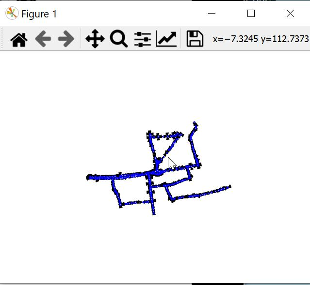

The network display can be zoomed, panned to get clearer view of the network.
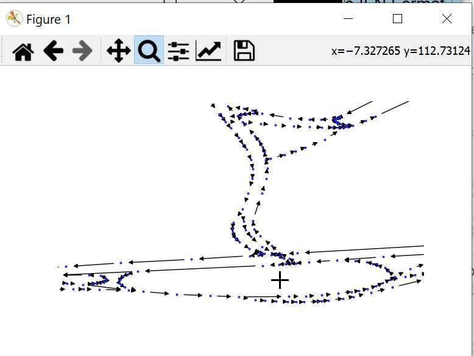
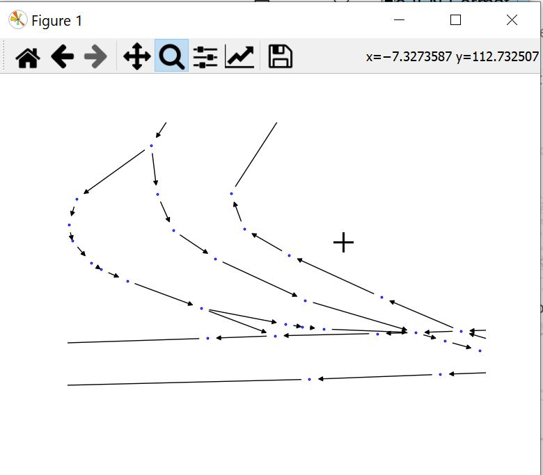

### Defining Scenario
You can open the scenario window from the main.py by clicking "Define and Run IFN Scenario" button , or from OSM2IFN window by clicking "Define Scenario" button.

First, select the project folder by browsing into the project folder that you have prepared. If there are already available scenarios in the project folder, they would be listed in the dropdown for existing scenario that you can select. Otherwise, simply type the scenario name to create a new scenario.
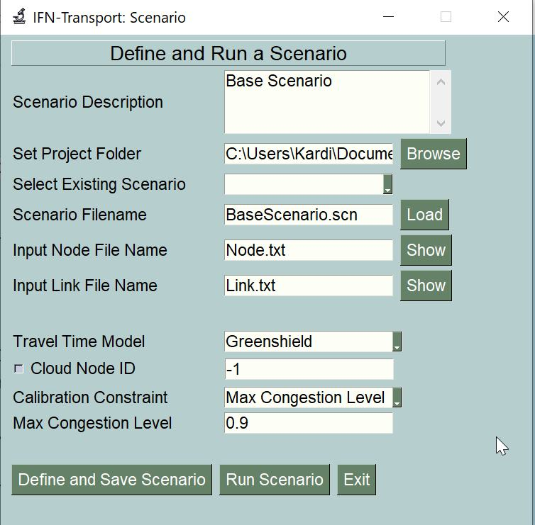

To define a scenario, you need to specify the following:
1. Scenario file name (must end with .scn)
2. Link file name 
3. Node file name
4. Travel Time model (eiter BPR or Greenshield)
5. Calibration Constraint and its value.

The link file and node file has been created when you download map from OSM. The minimum fields for link file consists of the following field:
> LinkID,Node1,Node2,Capacity,Distance,MaxSpeed

You need to modify such that the capacity is in PCU/hour, distance is in km/hour and max speed is in km/hour.

You can check the content of the link file by click "Show" button next to link file.
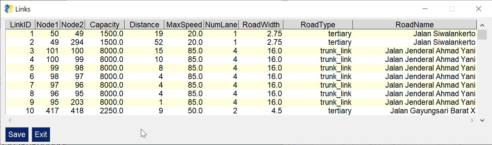

The capacity is in passenger car unit per hour (pcu/hour), the distance is in kilo meter and the max speed is in km/hour. The minimum node file would consist of the following field:

> NodeID,X,Y

Similarly, you can also check the content of the node file by click "Show" button next to node file.
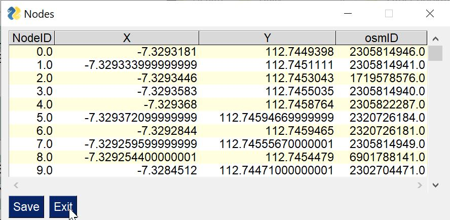

There are there three calibration constraint:

1. Maximum Congestion level (say set to 0.9)
2. Total Flow (for instance, you set it to 14000 pcu/hour)
3. Real Flow 

### Calibration with real world flow data
When you set the calibration constraint based on real flow, you need to prepare Real-Flow file, which consist of:

> LinkID,Node1,Node2,ActualFlow

The linkID must match with the Node1,Node2 which is from the link file. Once the scenarios and the associated files are ready, save the scenario to define it. Then click "Find Scaling Factor" button to get the optimum scaling factor.

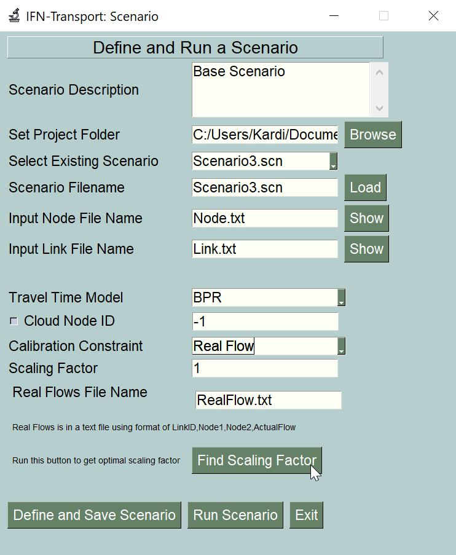

The optimization is done by maximizing the R-square or minimizing the sum square of error (SSE).
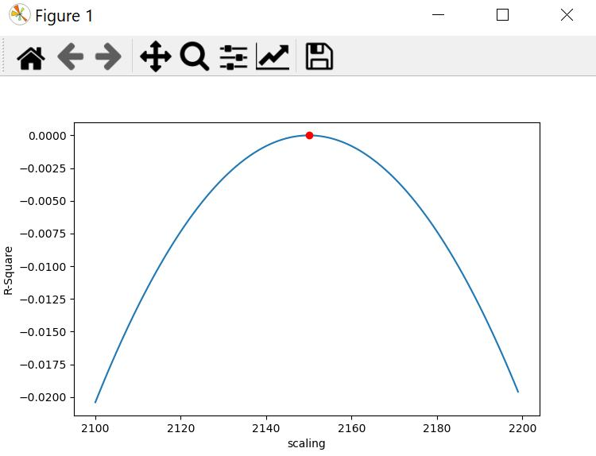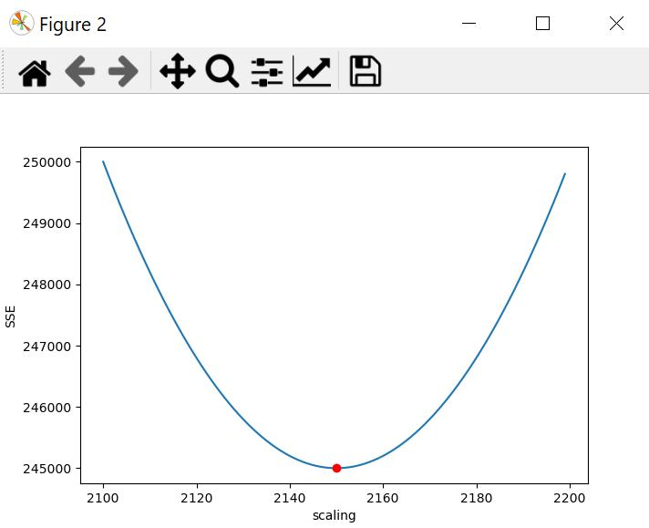

Set the scaling factor based on the suggested scaling factor and save the scenario. 

### Run the Scenario
Click "Run Scenario" in Scenario window to get the results. The result would be at the same name of the scenario file name but with extension of .CSV and .NET.

# IFN Transport Documentation
This document is the user guide to use the python code for Traffic Assignment based on Ideal Flow Network (IFN). The current version of this program should be run in Python 3.10 or higher version. The code include sample scenarios and documentation.

You do not need to know python programming language to use the program. You need to download python 3.10 or above including IDLE. If you know python programming language, it would be your advantage because you can analyze the results in more details than what explained in this document.

## Agreement of the Inputs
Each scenario in IFN requires three files: scenario file, node file and link file. 

## Scenario File
At the minimum, the scenario file consists of scenario name, a pointer to the node file and a pointer to the link file. The keywords on the left hand side of the equal sign must be kept unaltered. The right hand side of the equal sign can be anything.

> ScenarioName=MyScenario

> Node=node.txt

> Link=link.txt

The scenario name would be used to determine the name of the output files.

Inside the scenario file, you can also add additional parameters of the model based on the following keywords. The keywords must be on the left hand side (LHS) of the equal sign. The order of the keyword does not matter.

## Node File
A node file can be any name but the format must be in CSV. The first row is fixed header
> NodeID,X,Y

The header itself can be in any language but the location of each field must be fixed. For instance, the following header is also valid.
> myPointID,longitude,latitude

From the second row, you can specify the actual node-ID and the coordinate location in X and Y. The node-ID must be an integer number. There is no limit of the number of node and the node-ID is not necessarily in order. The coordinate location can be floating numbers or integers

## Link File
A link file can be any name but the format must be in CSV. The first row is fixed header

> LinkID,Node1,Node2,Capacity,Distance,MaxSpeed

The header itself can be in any language but the location of each field must be fixed.  

When downloading from OpenStreetMap (OSM), the program will first automatically compute the maximum speed and the capacity of each link before computing everything else. That means if you have your own maximum speed and link capacity for all links, then you can specify them in the links file. The result of this download frm OSM would be as follow:

> LinkID,Node1,Node2,Capacity,Distance,MaxSpeed,NumLane,RoadWidth,RoadType,RoadName

## Calibration Basis
The IFN would automatically calibrate the result based on certain assumptions. You can select between the two assumptions below:

1. Maintain the maximum congestion level
2. Maintain the demand of flow in the entire network
3. Based on real observation flow from the field survey

Maintaining the maximum congestion level would require you to specify the maximum allowable congestion parameter. The default value of the maximum allowable congestion is one. This option would set the maximum congestion level to your specification. It means you want to keep the maximum congestion in any link to be a constant among the scenarios that you are comparing. This option will help you to know what would be the maximum demand of flow that you can accommodate in your network.

Maintaining the total flow in the network indicates that you want to keep the demand to be constants among the scenarios that you are comparing. This option will set the total flow (including the flow in the dummy links) to be constant as to you total flow specification. This option will help you to know what would be the maximum congestion level given the total flow demand in the network.

In the scenario file, you can optionally specify the basis of calibration. If you set *calibrationBasis=totalFlow* then the program maintains the total flow in the network. This means you want to keep the total demand in the network to be invariant among all the scenarios. If the *calibrationBasis=maxCongestion* then it would maintain the maximum congestion level to be equaled to specified maximum allowable congestion parameter. 

When you have real flow data based on observation on the field survey,  you can  specify *calibrationBasis=realFlow*.

## Travel Time Model
There are two options of travel time models being used in IFN:

1. Greenshield model
2. BPR model

Using Greenshield’s traffic model, we assume the speed-density relationship is linear and the congestion level (which is equal to the flow/capacity) is set to be between zero and one. Since the congestion level is normalized to be between zero and one, it is easier to interpret the meaning of congestion level. However, the Greenshield tends to have higher speed than BPR (for the same congestion level) and only operates when the traffic is not so congested. 

BPR model produces better variation of speed and travel time even when the traffic is congested. However, in BPR model, the congestion level (which is equal to the flow/capacity) can go beyond 1, which make the definition of capacity somewhat confusing. Transportation engineers is often using BPR model in conjunction with the capacity derived from Highway Capacity Manual (HCM).  

In the scenario file, you can optionally specify the travel time model. If you want to set the travel time model to be Greenshield, then you put the following line in the scenario file:
travelTimeModel=Greenshield

Without specifying the travel time model, the program will use BPR travel time model as the default model of IFN. If you want to explicitly state that the travel time model is BPR, then you put the following line in the scenario file:
travelTimeModel=BPR

## Cloud Node
Transportation network is always strongly connected. When you can go somewhere, you must be able to go home. Sometimes your network (that you downloaded from the OSM) is not strongly connected. In tha case, you can either clean the network data based on the largest strongly connected component, or add a cloud node with dummy links. IFN theorem states that you only one cloud node to convert weakly connected network into a strongly connected network. 

If it happens that your network is weakly connected, then you need to create a cloud node and connect each of the source node (or source component) in the network into the cloud node through dummy links and connect the cloud node to each of the sink node (or sink component) in the network using dummy links. When you use a cloud node, you need to specify the node ID of the cloud node. This parameter will affect to hide all the dummy links from showing and the link performance of the dummy links would be set to nan (not-a-number). The network performance would be free from the dummy links. If you do not specify the cloud node, the program assume that your network has no cloud node and no dummy links and the network must be strongly connected.

# Future Development
There are a lot of fun stuff to develop further and if you have any critics, comments or suggestions to improve, [drop me a note](https://github.com/teknomo/ifn-transport/issues). I would welcome your contribution by any means, your programming time, donation or scientific ideas and so on.

In near future version, we will no longer use .scn file and we will use json format instead. You can preview the JSON format from the sample folders.

# Do your part
I hope you find this program useful for your study or work. You can help your own city by setting the base network on your city, and compute the scenarios that most likely will help to solve traffic congestion in your city. Share your ideas in social media and compare it with your friends. Talk with your city government about your ideas.
