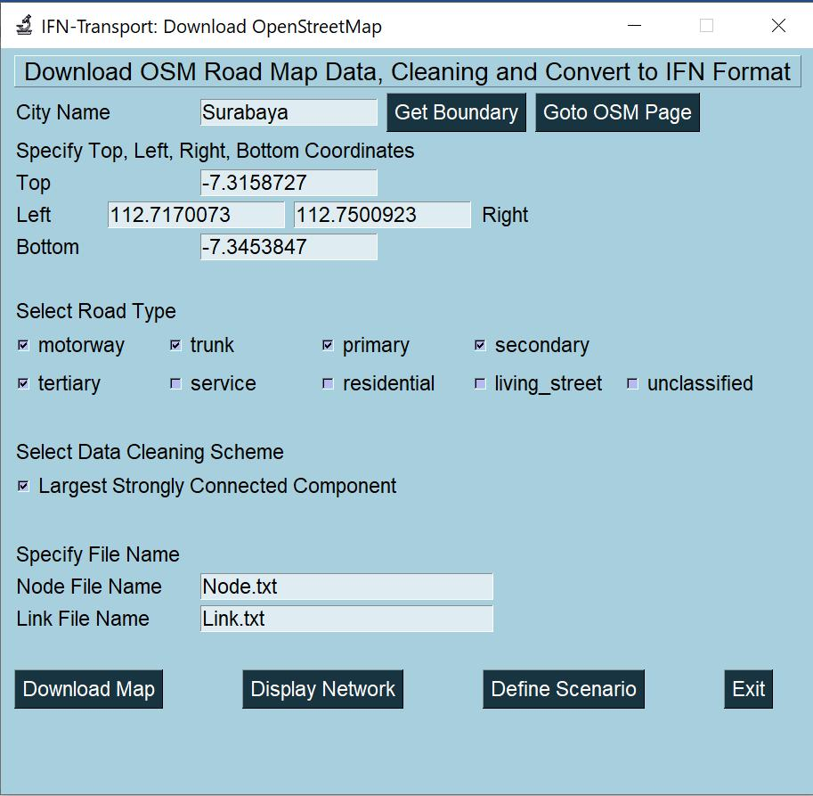

# IFN-Transport

IFN-Transport is an extension of Ideal Flow Network (IFN) for transportation networks synthesis and analysis.

## Installation
There is no need for installation. Copy the whole code into a local folder. 

## Run the IFN-Transport
Run **main.py** in Python.

The graphical user interface of the main program 

## Download OSM Data
Select the "Download OSM Data" buuton from the main.py to get the OSM2IFN.py windows, which graphical user interface is as follow.

If you type the city name and press "Get Boundary" button, it might help you to fill the coordinate boundary.
Alternatively, you can "Go to OSM" web page to set the coordinate boundary

Once the Top, Left, Right and Bottom coordinates are set, select the road type that you want to download, specify the file names of node and link if necessary. Them click "Download Map" button to download the map.

The original file from OSM is in XML format.

The IFN-Transport would convert it into CSV format that you can open in Excel.

The field of capacity, distance, max speed, number of lanes, road width would be approximated if not exist in OSM. Here are the fields of the converted OSM data.

> LinkID,Node1,Node2,Capacity,Distance,MaxSpeed,NumLane,RoadWidth,RoadType,RoadName

The field of the node file from OSM data would be as follow.
> NodeID,X,Y,osmID

The data would also be cleaned automatically to get the largest strongly connected network when you check the data cleaning scheme.

Once you have downloaded the map data, click "Display Network"

The network display can be zoomed, panned to get clearer view of the network.

## Defining Scenario
You can open the scenario window from the main.py by clicking "Define and Run IFN Scenario" button , or from OSM2IFN window by clicking "Define Scenario" button.

First, select the project folder by browsing into the project folder that you have prepared. If there are already available scenarios in the project folder, they would be listed in the dropdown for existing scenario that you can select. Otherwise, simply type the scenario name to create a new scenario.

To define a scenario, you need to specify the following:
1. Scenario file name (must end with .scn)
2. Link file name 
3. Node file name
4. Travel Time model (eiter BPR or Greenshield)
5. Calibration Constraint and its value.

The link file and node file has been created when you download map from OSM. The minimum fields for link file consists of the following field:
> LinkID,Node1,Node2,Capacity,Distance,MaxSpeed

You need to modify such that the capacity is in PCU/hour, distance is in km/hour and max speed is in km/hour.

You can check the content of the link file by click "Show" button next to link file.

The capacity is in passenger car unit per hour (pcu/hour), the distance is in kilo meter and the max speed is in km/hour. The minimum node file would consist of the following field:

> NodeID,X,Y

Similarly, you can also check the content of the node file by click "Show" button next to node file.

There are there three calibration constraint:
1. Maximum Congestion level (say set to 0.9)
2. Total Flow (say set it to 14000 pcu/hour)
3. Real Flow 

### Calibration with real world flow data
When you set the calibration constraint based on real flow, you need to prepare Real-Flow file, which consist of:

> LinkID,Node1,Node2,ActualFlow

The linkID must match with the Node1,Node2 which is from the link file. Once the scenarios and the associated files are ready, save the scenario to define it. Then click "Find Scaling Factor" button to get the optimum scaling factor.

The optimization is done by maximizing the R-square or minimizing the sum square of error (SSE).

Set the scaling factor based on the suggested scaling factor and save the scenario. 

## Run the Scenario
Click "Run Scenario" in Scenario window to get the results. The result would be at the same name of the scenario file name but with extension of .CSV and .NET.

